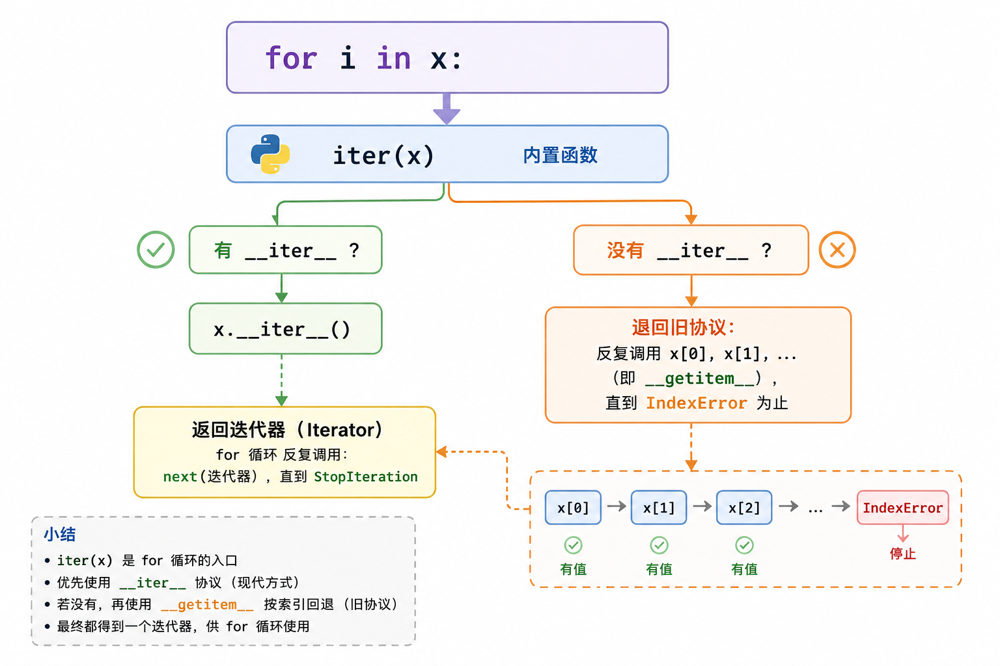
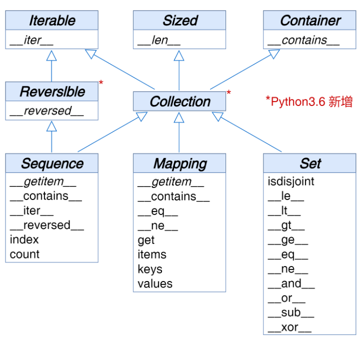

# Python 数据模型（Data Model）学习笔记

## 什么是 Data Model

我们可将 Python 视为一个**框架**，而 Data Model 就是对该框架的描述。它规范了语言自身各个组成部分的接口，如序列、函数、迭代器、协程（Coroutine）、类、上下文管理器等部分的行为。

- **框架的含义**：框架提供一套规范和钩子，你按规范实现接口，框架自动调用你的代码。Python 也一样——语言本身定义了一套"协议"，你的对象只要实现约定的方法，就能融入语言的各种语法。
- **为什么叫"模型"**：Data Model 就是"语法糖背后的协议表"，描述了"某种语法背后到底发生了什么"。

### 特殊方法（魔术方法）

形如 `__xxx__` 的双下划线方法。Python 解释器会调用特殊方法来执行基本的对象操作，这些操作通常由**特殊语法触发**。

关键点：

> **你通常不直接调用它们，而是由解释器CPython隐式调用。**

例如，为 `obj[key]` 语法提供支持的特殊方法为 `__getitem__`。当你写：

```python
my_collection[key]
```

解释器实际上执行的是：

```python
my_collection.__getitem__(key)
```

### 一个最小示例

只要类实现了 `__getitem__`，就能用 `[]` 语法访问：

```python
class MyList:
    def __init__(self):
        self.data = [10, 20, 30]

    def __getitem__(self, index):
        return self.data[index]

c = MyList()
print(c[1])   # 20 —— 语法 [] 触发了 __getitem__
```

### 常见语法与对应的特殊方法

若想让自定义对象支持 Python 的各种**内建语法/操作**，就需要实现对应的特殊方法，包括：容器（collections）、属性访问、迭代、运算符重载、函数和方法调用、字符串表示与格式化、异步编程、对象创建与销毁、上下文管理等。

| 想支持的语法 | 需要实现 |
|---|---|
| `obj[key]` | `__getitem__` |
| `len(obj)` | `__len__` |
| `for x in obj` | `__iter__` / `__next__` |
| `a + b` | `__add__` |
| `print(obj)` / `str(obj)` | `__str__` / `__repr__` |
| `with obj:` | `__enter__` / `__exit__` |
| `await obj` | `__await__` |

**Data Model 就是"语法糖背后的协议表"——特殊方法是协议的接口，实现了它们，自定义对象就能像内建类型（list、dict）一样自然地参与 Python 语法。**

[demo1.py](../../Python/Python数据模型/demo1.py)


## 魔术方法是如何起作用的

### 核心规则：你调用内置函数，解释器调用特殊方法

特殊方法是供 Python 解释器调用的，而不是供用户调用的。

```python
len(my_object)        # ✅ 正确写法
my_object.__len__()   # ❌ 不应这样写
```

当 `my_object` 是用户定义类的实例时，调用 `len(my_object)` 会触发解释器在幕后调用用户实现的 `__len__()` 方法。

### 内置类型的 C 层捷径

处理内置类型（如 `list`、`str`、`bytearray`）或扩展（如 NumPy 数组）时，解释器会走捷径：

- CPython 中可变长度容器的底层 C 实现，对应 `PyVarObject` 结构体
- 其中的 `ob_size` 字段直接保存容器中的项数
- 因此 `len(my_object)` 会**直接读取 `ob_size` 字段**，比调用 `__len__()` 方法快得多

```python
import timeit
timeit.timeit('len([1,2,3])')       # 快：直接读 ob_size
timeit.timeit('[1,2,3].__len__()')  # 慢：属性查找 + 方法调用
```

### 迭代的隐式调用链

特殊方法大多是隐式调用的。以 `for i in x:` 为例，解释器的执行顺序：



FrenchDeck 没有实现 `__iter__`，只实现了 `__getitem__`，解释器退回"从 0 开始按下标迭代"的旧协议，因此 `for card in deck` 依然可用。

### 实践准则

- **你的日常代码**：负责"实现"特殊方法，而不是"调用"它们（元编程场景除外）
- **唯一例外**：在自己的 `__init__` 中调用 `super().__init__()` 初始化父类
- **确实需要触发时**：调用对应的内置函数（`len` / `iter` / `str` 等）

内置函数的优势：

1. 除了隐式调用对应的特殊方法之外，通常还提供**额外的服务**（如 `iter()` 处理迭代协议的回退逻辑）
2. 对内置类型来说，调用内置函数比直接调用特殊方法**更快**（走 C 层捷径）

> **"实现它，而不是调用它"**——你写 `__len__`，用户写 `len()`；中间的桥由解释器和内置函数来搭。

### 魔术方法最重要的用途

#### 模拟数值类型

接下来将实现一个表示二维的向量类（Vector），也就是数学与物理中使用的 “欧几里得（Euclidean）向量”。

[demo2.py](../../Python/Python数据模型/demo2.py)

#### 字符串表示形式

**1. `__repr__` 由内置函数 `repr()` 调用**

特殊方法 `__repr__` 供 `repr()` 调用，以获取对象的字符串表示形式。若未定义，实例只会显示 `<Vector object at 0x10e100070>` 这种"内存地址"形式，毫无信息量。

**2. repr() 在很多场景下被隐式调用**

- 交互式控制台回显（输入 `v` 回车）
- 调试器显示变量
- `%` 格式化中的 `%r` 占位符
- `str.format` / f-string 中的 `!r` 转换字段

**3. 为什么 `__repr__` 里推荐用 `!r` 格式化属性**

`!r` 表示"用 repr() 显示该属性"，能**保留类型信息、消除歧义**：

```python
x = '1'
f'{x}'    # 1     ← 看不出是字符串还是数字
f'{x!r}'  # '1'   ← 带引号，一眼看出是字符串
```

因此 `Vector(1, 2)` 与 `Vector('1', '2')` 在输出上能明显区分——后者传了字符串，但 `Vector.__init__` 接受的是数字类型，传字符串不可用。repr 如实暴露类型，问题一眼可见。

**4. `__repr__` 的设计目标：与源码一致、可重建**

返回的字符串不应有歧义，最好以"构造函数调用"的形式输出（如 `Vector(3, 4)`），方便开发者根据输出重新创建该对象。

**5. `__str__` 与 `__repr__` 的分工**

| | `__repr__` | `__str__` |
|---|---|---|
| 触发方式 | `repr()`、控制台回显、调试器、`%r`、`!r` | `str()`、`print()` |
| 面向对象 | **开发者** | **终端用户** |
| 目标 | 无歧义、可重建 | 可读、友好 |

回退规则：继承自 `object` 的用户类若**未定义 `__str__`，`str()` / `print()` 会自动回退调用 `__repr__`**。所以当 `__repr__` 返回的字符串已足够友好时，无需再定义 `__str__`。

> 在 Python 中，如果必须在 `__repr__` 与 `__str__` 之间二选一，则建议选择 `__repr__`——它给程序员看，还能兜底 `print()`。

#### 自定义类型的bool值

Python 有一个 bool 类型，可以在需要布尔值的地方处理对象。例如，if 或 while 语句的条件表达式，或运算符 and、or、not 的操作数。为了确定对象 x 表示的值是 True 或 False，Python 会在幕后调用 bool(x)，将返

回 True 或 False。默认情况下，用户定义类的所有实例都是 True，除非类中实现了 __bool__ 或 __len__ 特殊方法 。具体来说，当用户调用 bool(x) 时，Python 将在幕后调用 x.__bool__() 方法；若未实现 __bool__

()，则 Python 将继续尝试调用 x.__len__() 方法；若 x.__len__() 返回 0，则 bool(x) 返回 False，否则返回 True。

### 容器（collection）API

Python 语言中的基本（essential）容器类型8的接口如图所示：



图中所有的类都是抽象基类（ABCs）。理解这张图，先分清两个主角：

#### 1. 容器 vs 抽象基类：谁是产品，谁是标准

| | 容器（collection） | 抽象基类（ABC） |
|---|---|---|
| 是什么 | 真实存在的对象，**真的装数据** | 一份"验收标准"，**不装任何数据** |
| 例子 | `list`、`str`、`tuple`、`dict`、`set` | `Iterable`、`Collection`、`Sequence`…… |
| 能否实例化 | 能（`list()` 就是造一个） | **不能**（证据见下） |
| 作用 | 干活 | 规定"**合格容器必须会做哪些事**" |

两者的联系只有一句话：

> **ABC 是"产品验收标准"，容器是"产品"。产品不必继承标准，但只要把标准要求的本事都学会了，就是标准意义上的合格容器。**

ABC（集中在标准库 `collections.abc` 模块）有 3 个用途：

1. **当说明书**：想自造容器，看一眼 `Sequence` 就知道必须实现哪些方法；
2. **当验收工具**：`isinstance(obj, Sequence)` 检查"这个对象算不算序列"；
3. **当免费代码库**：继承它可以"白得"一批方法的默认实现（见第 5 小节 mixin）。

"产品不继承标准"实测验证（CPython 3.12）：

```python
>>> list.__mro__                 # list 的继承链里没有任何 ABC
(<class 'list'>, <class 'object'>)
>>> isinstance([], Collection)   # 但 list 照样通过验收
True
```

验收**不查户口（继承关系），只验货（方法齐不齐）**——这就是鸭子类型（见第 3 小节）。

#### 2. 三个顶层单项标准 + Collection"打包"

3 个顶层 ABC 是三张**单项标准**，每张只有 1 条要求：

| 单项标准 | 清单上的全部要求 | 达标后能用 |
|---|---|---|
| `Iterable` | `__iter__` | `for x in obj`、拆包 |
| `Sized` | `__len__` | `len(obj)` |
| `Container` | `__contains__` | `x in obj` |

**Collection（Python 3.6 新增）= 三张单项标准合成一张**。"打包"不是比喻，它在源码（`_collections_abc.py`）里就是普通的多重继承：

```python
class Collection(Sized, Iterable, Container): ...
```

图中那三条空心箭头画的就是这三重继承。打包后，Collection 的验收清单共 3 条：`__iter__`、`__len__`、`__contains__`。

ABC 不能实例化的证据——报错信息会把验收清单念出来：

```python
>>> Collection()
TypeError: Can't instantiate abstract class Collection without
an implementation for abstract methods '__contains__', '__iter__', '__len__'
```

#### 3. 鸭子类型：按标准交付，不靠继承

**鸭子类型（duck typing）**：判断一个对象"是不是某类东西"，不看它的**出身**（它是什么类、继承了谁），只看它的**行为**（有没有该有的方法）。名字来自俗语："走起来像鸭子、叫起来像鸭子——那它就是鸭子。"

为什么 Python 能这样设计？回忆前文核心规则——**"你调用内置函数，解释器调用特殊方法"**：`len(obj)` 执行时，解释器只做一件事——在 `obj` 身上找到 `__len__` 并调用，从头到尾不查"继承了谁"。**解释器只认方法，不认血统。**（Java 等静态语言则必须显式 `implements`，编译器查户口。）

例如一个不继承任何 ABC 的类，实现 3 个方法即可通过"基础容器"验收：

```python
class Bag:                          # 继承链只有 (Bag, object)
    def __init__(self, items):
        self.items = list(items)
    def __iter__(self):             # 达标 Iterable
        return iter(self.items)
    def __len__(self):              # 达标 Sized
        return len(self.items)
    def __contains__(self, x):      # 达标 Container
        return x in self.items
```

```python
>>> b = Bag([1, 2, 3])
>>> list(b), len(b), 2 in b
([1, 2, 3], 3, True)
>>> isinstance(b, Collection)       # 通过"基础容器"验收
True
>>> isinstance(b, Sequence)         # 缺 __getitem__，"序列"验收不过
False
```

这正是原文"只要实现了 `__len__`，就**可视为** Sized 的子类"的含义：血缘上不是，**行为上算数**。同时可见**标准是分层验收**的：齐了 3 条基本功算 `Collection`；要算 `Sequence`，还得有 `__getitem__`。

#### 4. 三个专用接口：按"怎么取东西"划分

Collection 之下的三张专业标准，回答的问题是"你**靠什么取东西**"：

| 标准 | 额外核心方法 | 取东西方式 | 对应产品 |
|---|---|---|---|
| `Sequence` | `__getitem__`、`index`、`count` | 按**位置**取：`s[0]` | `list`、`str`、`tuple` |
| `Mapping` | `__getitem__`、`get`、`keys`、`items`、`values` | 按**键**取：`d["k"]` | `dict`、`collections.defaultdict` |
| `Set` | `__le__`、`__and__`、`__or__` 等 | 判断**在不在**、集合运算 | `set`、`frozenset` |

易错点：Sequence / Mapping / Set 这层标准对内置类型是**点名认证**（在 `_collections_abc.py` 中显式注册），并非"有方法就自动过关"。因为光看方法名分不清语义——`dict` 也有 `__getitem__` 和 `__len__`，但它按键取而非按位置取，所以 `isinstance({}, Sequence)` 为 `False`。

**为什么只有 Sequence 继承了 Reversible**：`reversed(obj)` 需要"倒着数位置"。序列有位置概念，倒序 = 从最后一个下标往前走，天然成立；Mapping 与 Set 没有"第几个"的概念，倒序无从谈起。

> 自 Python 3.7 开始，内置 dict 类型也正式有顺序（ordered）了，但只是保留 "键（Key）" 的插入顺序，无法随意重新排列 dict 中的 "键（Key）"。

**Set 的特殊方法全是中缀运算符**——数据模型"语法背后是特殊方法"的又一次落地：

```python
a & b   # 交集   → a.__and__(b)
a | b   # 并集   → a.__or__(b)
a - b   # 差集   → a.__sub__(b)
a ^ b   # 对称差 → a.__xor__(b)
```

#### 5. 继承 ABC 的实利：白得 mixin 方法

既然不继承也达标，为什么还要继承？因为很多 ABC 自带**现成实现（mixin，混入）**——只实现核心方法，其余白得：

```python
class Range2(Sequence):
    def __init__(self, n):
        self.n = n
    def __getitem__(self, i):       # 只实现这 2 个方法
        if 0 <= i < self.n:
            return i * 10
        raise IndexError
    def __len__(self):
        return self.n
```

```python
>>> r = Range2(5)
>>> r[2]                # 自己写的
20
>>> list(r)             # __iter__ 白得（Sequence 用 __getitem__ 实现好了）
[0, 10, 20, 30, 40]
>>> 30 in r             # __contains__ 白得
True
>>> r.index(30), r.count(20)
(3, 1)
>>> list(reversed(r))   # __reversed__ 白得
[40, 30, 20, 10, 0]
```

于是自造容器有两条路线，都能通过 `isinstance` 验收：**裸实现**（如 Bag，全部自己写）与**继承 ABC**（如 Range2，只写核心几个 + 白得其余）。

#### 6. 一张图收尾

上层是标准（ABC），下层是产品（容器），中间的桥是"**实现方法**"，而不是"继承"：

```
【标准层】ABC：不装数据、不能实例化
Iterable      Sized       Container        ← 单项标准（各 1 条要求）
    ↖            │            ↗
         Collection                ← 3.6 新增"合订本"（3 条要求）
         ↗      │      ↘
  Sequence   Mapping    Set           ← 专业标准（按位置 / 按键 / 集合运算）
      ↓          ↓         ↓
【产品层】真实容器：装数据、能实例化
list,str,tuple   dict    set,frozenset
```

接下来的两章会详细介绍标准库中的序列（sequences）、映射（mappings）和集合（sets）。
现在，我们来看看 Python Data model 中定义的特殊方法的主要类别

## 特殊方法概述

按功能类别整理常用的特殊方法。记忆主线依然是：**语法 / 内置函数 → 解释器在幕后调用对应特殊方法**。第一列是"你想让对象支持什么"，第二列是"你要实现什么"。

### 1. 对象创建与销毁

| 方法 | 触发场景 |
|---|---|
| `__new__` | 创建实例（先于 `__init__` 调用；定制不可变类型、单例时用它） |
| `__init__` | 初始化实例（`MyClass(...)` 时触发） |
| `__del__` | 实例被垃圾回收时（调用时机不保证，勿依赖它释放关键资源） |

### 2. 字符串表示形式

| 方法 | 触发语法 / 内置函数 | 说明 |
|---|---|---|
| `__repr__` | `repr(obj)`、控制台回显、调试器、`%r`、`!r` | 面向**开发者**：无歧义、可重建 |
| `__str__` | `str(obj)`、`print(obj)`、f-string | 面向**用户**：可读友好（缺省回退 `__repr__`） |
| `__format__` | `format(obj, spec)`、f-string 格式说明符 | 如 `f'{v:.3f}'` 中的 `.3f` |
| `__bytes__` | `bytes(obj)` | 字节串表示 |

### 3. 布尔值与数值转换

| 方法 | 触发场景 |
|---|---|
| `__bool__` | `bool(x)`、if / while 条件、and / or / not（未实现则回退 `__len__`，再回退 True） |
| `__int__` / `__float__` | `int(x)` / `float(x)` |
| `__index__` | 需要"纯整数"的场合：切片 `s[x]`、下标、`hex(x)`、`oct(x)` 等 |
| `__round__` | `round(x)`、`round(x, n)` |
| `__abs__` | `abs(x)` |
| `__neg__` / `__pos__` / `__invert__` | 一元 `-x` / `+x` / `~x` |

### 4. 容器与序列

| 方法 | 触发语法 / 内置函数 | 说明 |
|---|---|---|
| `__len__` | `len(obj)` | 项数 |
| `__getitem__` | `obj[k]`、切片 `obj[1:3]` | 取值；切片以 `slice` 对象传入，需自行处理 |
| `__setitem__` | `obj[k] = v` | 赋值 |
| `__delitem__` | `del obj[k]` | 删除 |
| `__contains__` | `x in obj` | 成员判断（未实现时解释器用 `__iter__` 线性扫描兜底） |
| `__iter__` | `for x in obj`、`iter(obj)`、拆包 | 返回迭代器 |
| `__next__` | `next(it)` | 迭代器的"下一步"（由 `__iter__` 返回的对象实现） |
| `__reversed__` | `reversed(obj)` | 反向迭代 |
| `__missing__` | `d[k]` 查不到键时 | 仅被 dict 的查找逻辑调用，如 `collections.defaultdict` 用它实现"缺键自动生成" |

### 5. 算术运算符：常规 / 反身 / 原地 三个版本

以 `+` 为例记住规则，其余运算符同理：

```python
a + b      # ① 先调 a.__add__(b)
           # ② 若 a 不支持或返回 NotImplemented → 调 b.__radd__(a)（反身版，交换操作数）
a += b     # ③ 优先调 a.__iadd__(b)（原地版，就地修改）；无 iadd 则回退 a = a + b
```

| 运算符 | 常规 | 反身 | 原地 |
|---|---|---|---|
| `+` | `__add__` | `__radd__` | `__iadd__` |
| `-` | `__sub__` | `__rsub__` | `__isub__` |
| `*` | `__mul__` | `__rmul__` | `__imul__` |
| `/` | `__truediv__` | `__rtruediv__` | `__itruediv__` |
| `//` | `__floordiv__` | `__rfloordiv__` | `__ifloordiv__` |
| `%` | `__mod__` | `__rmod__` | `__imod__` |
| `**` | `__pow__` | `__rpow__` | `__ipow__` |
| `@` | `__matmul__` | `__rmatmul__` | `__imatmul__` |

> `@` 是矩阵乘法（3.5+），普通数字类型不支持，主要为 NumPy 等库预留。

### 6. 比较运算符与哈希

| 运算符 / 用途 | 方法 |
|---|---|
| `==` / `!=` | `__eq__` / `__ne__` |
| `<` / `<=` | `__lt__` / `__le__` |
| `>` / `>=` | `__gt__` / `__ge__` |
| `hash(x)`、dict 的键、set 成员 | `__hash__` |

要点：

- `!=` 不定义也行——默认自动取 `__eq__` 结果的反；
- 定义了 `__eq__` 的类，实例默认**不可哈希**（`__hash__` 被自动置为 None），要放进 dict/set 需同时定义 `__hash__`；
- 比较方法在"无法比较"时返回 `NotImplemented`（特殊常量，不是异常），解释器会再尝试反身版本，最后报 `TypeError`；
- `__lt__` 等排序方法齐全后，`functools.total_ordering` 装饰器可帮你补齐其余比较方法。

### 7. 属性访问（动态属性 / 自省）

| 方法 | 触发场景 |
|---|---|
| `__getattr__` | **常规属性查找失败**时才调用（做代理、懒加载、动态属性） |
| `__getattribute__` | **所有**属性访问都经过它（慎用，处理不当易无限递归） |
| `__setattr__` / `__delattr__` | `obj.x = v` / `del obj.x` |
| `__dir__` | `dir(obj)` |

> `__getattr__` 与 `__getattribute__` 的区别是高频面试题：前者是"找不到兜底"，后者是"每次必经"。

### 8. 调用与协程

| 方法 | 触发场景 |
|---|---|
| `__call__` | `obj(...)`——把实例当函数调用（带状态的装饰器、回调对象常用） |
| `__await__` | `await obj`（返回迭代器，供事件循环驱动） |

### 9. 上下文管理（with）

| 方法 | 触发场景 |
|---|---|
| `__enter__` | 进入 `with` 块时调用，返回值绑定给 `as` 后的变量 |
| `__exit__` | 离开 `with` 块时调用，**无论正常结束还是抛异常**；返回 True 可吞掉异常 |

### 10. 异步版本（async for / async with）

| 方法 | 触发场景 |
|---|---|
| `__aiter__` / `__anext__` | `async for x in obj`（异步迭代） |
| `__aenter__` / `__aexit__` | `async with obj`（异步上下文管理） |

> 这些方法本身是协程函数，需在 `async def` 环境中使用。

